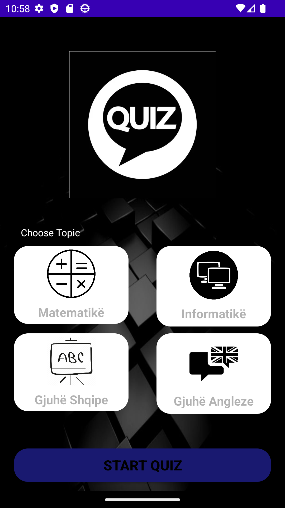
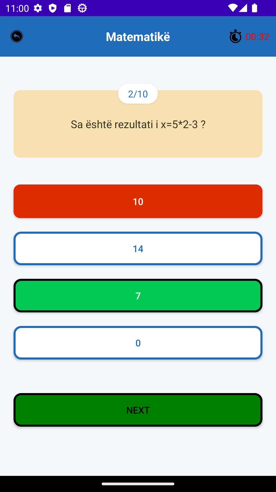

<h1 align="center">
MaturaQuiz
</h1>

A quiz for testing your SAT skills

## Screenshots

## Features

- Take quizzes from 4 different subjects in Albanian.

- See your correct and incorrect total answers.

- User friendly and modern UI.

- Fully offline with no ads.

- Free and Open source

- Small application size

# Development

This application was made using Android Studio and Java.

There are 5 classes

- MainActivity - Controller of MVC architecture

- QuestionsBank - Contains all the questions

- QuestionsList - Calculates correctness of answers

- QuizActivity - Quiz acivity

- QuizResults - Results of taken quiz

The clases are connected to eachother. MainActivity as we call it is the head or the controller of the application, it calls all the functions and classes needed to make the quiz work. QuestionBank is where all of the questions that we ask the user's are (includes Math, Technology, Albanian and English). QuestionsList makes count of the correct and uncorrect questions that are asked throughout the test. QuizActivity has to deal with the activity on the quiz (count the seconds on each question etc.). QuizResults is a class which has to deal with the total count of the questions answerd right and wrong, using the class QuestionList from which gives an answer to how each question is answerd QuizResults class does the math and calculates it and sends it directly to the UI after the user is done answering all the questions of a specific subject.

# License

Copyright (C) 2023 NitroNyte

This program is free software: you can redistribute it and/or modify it under the terms of the GNU Affero General Public License as published by the Free Software Foundation, either version 3 of the License, or (at your option) any later version.

This program is distributed in the hope that it will be useful, but WITHOUT ANY WARRANTY; without even the implied warranty of MERCHANTABILITY or FITNESS FOR A PARTICULAR PURPOSE. See the GNU Affero General Public License for more details.

You should have received a copy of the GNU Affero General Public License along with this program. If not, see https://www.gnu.org/licenses/.
